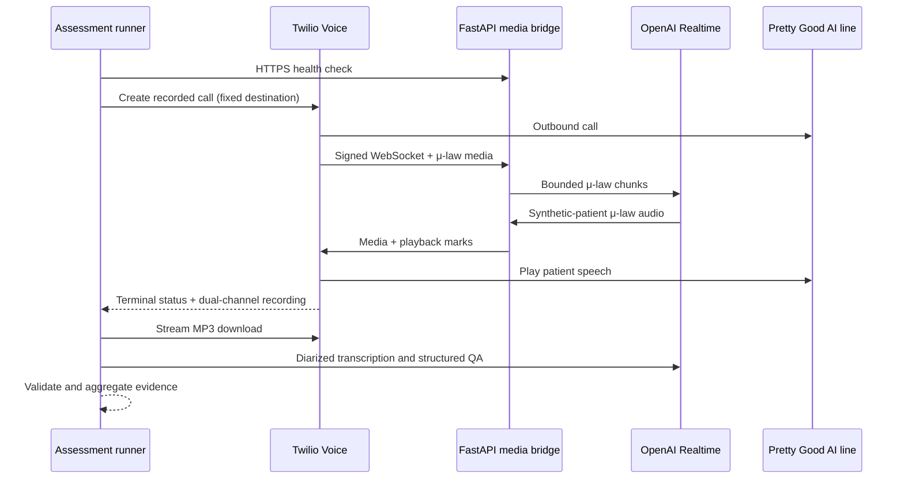

# Architecture decision and implementation

## Challenge-level summary

The solution is a safety-bounded synthetic patient that uses Twilio for one recorded outbound call
and a bidirectional Media Stream, then uses an OpenAI Realtime agent for low-latency speech-to-speech
behavior. Twilio's 8 kHz G.711 μ-law frames are relayed without resampling. The bridge buffers about
50 ms at a time in one reusable `bytearray`, supports interruption with semantic voice activity
detection and Twilio `clear` messages, tracks audio that was actually played, and closes every task,
session, and buffer in a `finally` block. A strict configuration model plus a second telephony-layer
check makes `+18054398008` the only dialable destination.

After each call, the runner streams the dual-channel MP3 to an atomic temporary file, persists a
role-labelled transcript, obtains an independent diarized transcription, and runs a schema-validated
QA review against the scenario's goals and probes. Every call receives an immutable run directory
with a manifest, recording, transcripts, issue report, and resource metrics. Ten calls run
sequentially so one caller number, cost, and failure state remain easy to audit.

## Data flow

## Components and complexity

| Component | Responsibility | Expected complexity |
|---|---|---|
| `ScenarioCatalog` | Strict safe-YAML load and hash index | Build O(n); lookup O(1) average |
| `MediaBridge` | Bounded audio relay and playback tracking | O(audio bytes + history) |
| `TwilioGateway` | Fixed call creation, bounded polling, streamed download | O(polls + recording bytes) |
| `AssessmentRunner` | Orchestrate evidence and failure manifests | O(call duration + artifacts) |
| `history_to_turns` | One-pass role-labelled transcript conversion | O(items + transcript characters) |
| `validate_submission` | Full multi-error evidence gate | O(files + artifact bytes) |
| `render_bug_report` | Aggregate and severity-sort findings | O(issues log issues) |

## Why this design

A streaming speech-to-speech path best matches the scoring emphasis on natural pacing, steering, and
turn-taking. A separate STT → LLM → TTS chain offers more intermediate control but adds multiple
network turns and more interruption state. Direct SIP could remove part of the application relay,
but Media Streams make the allowlisted outbound call, dual-channel recording, and exact artifacts
easy to inspect. Hosted inference also means the local runtime has no GPU allocation or model-weight
memory overhead.

## Reliability decisions

- All input boundaries use Pydantic, safe YAML, strict E.164 patterns, message-size limits, and
  validated base64.
- Polling uses monotonic deadlines; no unbounded retry or queue exists.
- Audio downloads stream in 64 KiB chunks and replace the destination atomically.
- The public endpoint exposes only liveness and the authenticated media WebSocket.
- A manifest is written before a call, after important transitions, on failure, and at completion.
- Live evidence is deliberately not fabricated. The submission gate cannot pass until ten genuine
  completed recordings and transcripts are present.

## Primary sources

- OpenAI Agents SDK Realtime guide: https://openai.github.io/openai-agents-python/realtime/guide/
- OpenAI official Twilio example: https://github.com/openai/openai-agents-python/tree/main/examples/realtime/twilio
- Twilio bidirectional Media Streams: https://www.twilio.com/docs/voice/media-streams
- Twilio Call resource and recording parameters: https://www.twilio.com/docs/voice/api/call-resource
